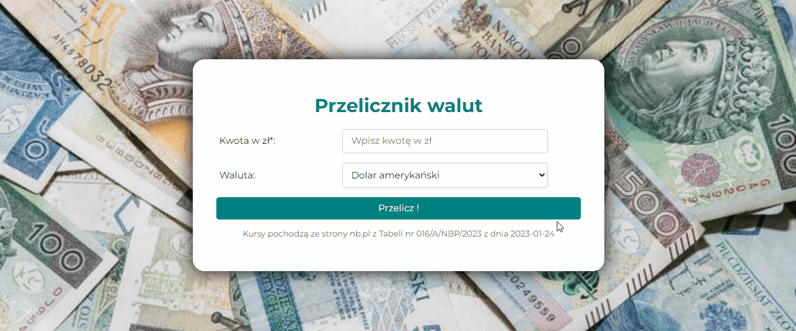

# Currency calculator in React.js

This project was bootstrapped with [Create React App](https://github.com/facebook/create-react-app).

## Description
This is a currency calculator for three different currencies: USD, EURO, GBP. Please take a look at demo.

## Demo 
https://kingapalijewska.github.io/currency-calculator-react/

## Technologies:
- HTML
- CSS 
- JavaScript
- Styled-components
- ES6+
- Node.js
- React
- customs hook

## Available Scripts

In the project directory, you can run:

### `npm start`

Runs the app in the development mode.\
Open [http://localhost:3000](http://localhost:3000) to view it in your browser.

The page will reload when you make changes.\
You may also see any lint errors in the console.

### `npm run build`
Builds the app for production to the build folder.
It correctly bundles React in production mode and optimizes the build for the best performance.

The build is minified and the filenames include the hashes.
Your app is ready to be deployed!

See the section about deployment for more information.
